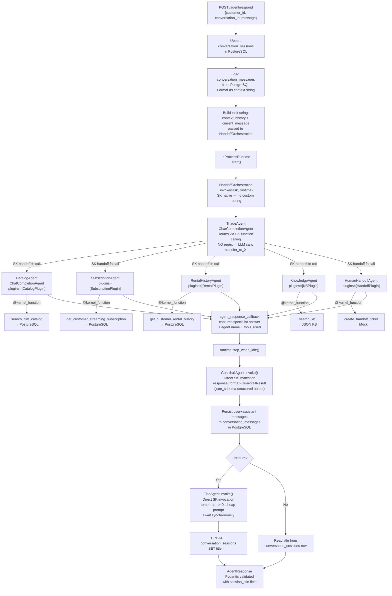

# Multi-Agent AI Support Assistant — Plan

## Project Location
`~/Projects/streaming-support-agent`

## Stack
- Python 3.12, FastAPI, `semantic-kernel>=1.43.0`, PostgreSQL (local), Alembic, SQLAlchemy async, Pydantic v2, Pytest, Structlog, Langfuse, `mcp` (Python SDK)
- Model: `gpt-4.1-mini` (configurable via `OPENAI_MODEL` in `.env`; assignment doc calls it "GPT 5.4 mini")

## SK Version Note
`semantic-kernel` has been rebranded **Microsoft Agent Framework** at v1.0+. We use the `semantic-kernel` PyPI package (≥1.43.0). Key imports:
- `from semantic_kernel.agents import ChatCompletionAgent, HandoffOrchestration, OrchestrationHandoffs`
- `from semantic_kernel.agents.runtime import InProcessRuntime`
- `from semantic_kernel.functions import kernel_function`
- `from semantic_kernel.connectors.ai.open_ai import OpenAIChatCompletion`
- `AgentGroupChat` is **deprecated and removed** — we do NOT use it

---

## Project Structure

```
streaming-support-agent/
├── app/
│   ├── main.py                    # FastAPI app + lifespan — builds Kernel once on startup
│   ├── api/
│   │   └── routes.py              # POST /agent/respond, POST /agent/respond/stream, GET /agent/sessions/{id}
│   ├── agents/
│   │   ├── factory.py             # build_agents() → (List[ChatCompletionAgent], OrchestrationHandoffs)
│   │   ├── triage.py              # TriageAgent definition + system prompt
│   │   ├── catalog.py             # CatalogAgent + CatalogPlugin
│   │   ├── subscription.py        # SubscriptionAgent + SubscriptionPlugin
│   │   ├── rental_history.py      # RentalHistoryAgent + RentalPlugin
│   │   ├── knowledge.py           # KnowledgeAgent + KBPlugin
│   │   ├── human_handoff.py       # HumanHandoffAgent + HandoffPlugin
│   │   └── guardrail.py           # GuardrailAgent — direct invoke, response_format=GuardrailResult
│   ├── plugins/                   # @kernel_function decorated classes (SK plugin pattern)
│   │   ├── catalog_plugin.py      # search_film_catalog(query) → Postgres
│   │   ├── subscription_plugin.py # get_customer_streaming_subscription(customer_id) → Postgres
│   │   ├── rental_plugin.py       # get_customer_rental_history(customer_id) → Postgres
│   │   ├── kb_plugin.py           # search_kb(query) → JSON KB
│   │   └── handoff_plugin.py      # create_handoff_ticket(summary, reason) → mock
│   ├── db/
│   │   ├── session.py             # SQLAlchemy async engine + session factory
│   │   ├── models.py              # ORM: Film, StreamingSubscription, ConversationSession, ConversationMessage
│   │   └── history.py             # ChatHistoryService: upsert_session, load_messages, save_turn, format_context
│   ├── schemas/
│   │   └── response.py            # Pydantic: AgentRequest, AgentResponse, GuardrailResult, TitleResult
│   ├── orchestrator.py            # run_turn(): HandoffOrchestration setup, invoke, capture callback, run guardrail
│   └── core/
│       ├── config.py              # Pydantic Settings (reads .env)
│       └── logging.py             # structlog setup
├── alembic/
│   ├── versions/
│   │   ├── 001_add_streaming_available.py
│   │   ├── 002_create_streaming_subscription.py
│   │   └── 003_create_conversation_tables.py
│   └── env.py
├── mcp/
│   └── server.py                  # pagila-support-mcp — exposes 3 DB-backed tools via mcp Python SDK
├── kb/
│   └── articles.json              # 5–8 mock support articles with source field
├── evals/
│   ├── eval_cases.json            # 10+ structured eval examples
│   └── run_evals.py               # Async eval runner — calls /agent/respond, checks all fields, prints report
├── tests/
│   ├── conftest.py                # DB fixtures, mock kernel, mock plugins
│   ├── test_tools.py              # Test each plugin with mocked DB session
│   ├── test_agents.py             # Test HandoffOrchestration routing + specialist responses
│   └── test_guardrails.py         # Test prompt injection, sensitive mutation blocking, schema validation
├── docs/
│   ├── design.md
│   ├── implementation_plan.md
│   └── ai_usage.md
├── .env.example
├── alembic.ini
├── requirements.txt
└── README.md
```

---

## Architectural Constraints (Hard Rules)

### 1. No Regex for Routing or Intent Detection — SK `HandoffOrchestration` Does It
- Routing is handled entirely by SK's **`HandoffOrchestration`** pattern. This is the correct SK-native mechanism for customer support triage — it mirrors our exact use case (the SK sample at `step4_handoff.py` is a customer support triage system).
- SK automatically injects `transfer_to_<AgentName>(reason)` as function calls available to the `TriageAgent`. The LLM calls these functions; we write zero routing code.
- `OrchestrationHandoffs` declaratively registers which agents the TriageAgent can route to and under what circumstances (natural language descriptions, not rules).
- No `if/elif`, no keyword lists, no regex, no custom dispatcher anywhere in the routing path.
- Fallback: if the LLM does not transfer, `KnowledgeAgent` is set as the default final agent in `OrchestrationHandoffs`.

```python
# How routing is declared — no custom code, just declarative SK config
handoffs = (
    OrchestrationHandoffs()
    .add_many(
        source_agent="TriageAgent",
        target_agents={
            "CatalogAgent":       "Transfer when question is about film catalog or streaming availability",
            "SubscriptionAgent":  "Transfer when question is about streaming subscription or renewal",
            "RentalHistoryAgent": "Transfer when question is about rental history",
            "KnowledgeAgent":     "Transfer for general support questions or how-to questions",
            "HumanHandoffAgent":  "Transfer when customer requests human, or request is sensitive/risky",
        },
    )
    # Specialists can bounce back to triage if needed
    .add("CatalogAgent",       "TriageAgent", "Transfer back if question is not catalog related")
    .add("SubscriptionAgent",  "TriageAgent", "Transfer back if question is not subscription related")
    .add("RentalHistoryAgent", "TriageAgent", "Transfer back if question is not rental related")
    .add("KnowledgeAgent",     "TriageAgent", "Transfer back if question is not general support")
    .add("HumanHandoffAgent",  "TriageAgent", "Transfer back if escalation is not needed")
)
```

### 2. Chat History and Session Data in PostgreSQL
- **PostgreSQL is the source of truth** for all conversation state. Two new tables are added via Migration 003:

```
conversation_sessions
  id              VARCHAR  PK  (= conversation_id from request)
  customer_id     INTEGER  FK → customer
  title           VARCHAR(200)   — LLM-generated, populated after first turn
  status          VARCHAR(20)    — active | escalated | closed
  created_at      TIMESTAMP
  updated_at      TIMESTAMP

conversation_messages
  id              SERIAL   PK
  conversation_id VARCHAR  FK → conversation_sessions
  role            VARCHAR(20)   — user | assistant | tool
  content         TEXT
  agent_used      VARCHAR(50)
  intent          VARCHAR(50)
  tools_used      JSONB
  metadata        JSONB    — token usage, confidence, latency_ms
  created_at      TIMESTAMP
```

- On each request the orchestrator:
  1. Upserts a `conversation_sessions` row (creates on first turn, updates `updated_at` on subsequent turns)
  2. Loads all `conversation_messages` rows for `conversation_id`, ordered by `created_at`, and hydrates a SK `ChatHistory`
  3. Appends the new user message, runs the agent pipeline, then writes the assistant message back to `conversation_messages`
- An in-process `dict[str, ChatHistory]` acts as an **L1 cache** to avoid repeated DB reads within the same server process. DB is authoritative on startup / cache miss.

### 3. Auto-Generated Session Title (One LLM Call)
- After the **first user turn** is saved (i.e., `conversation_messages` count transitions from 0 → 1 assistant reply), a **single async LLM call** is fired in the background:
  - Model: same cheap model, temperature 0
  - Prompt: `"Generate a short, descriptive 4–6 word title for this support conversation based on the user's first message. Return only the title, no punctuation. Message: '{first_message}'"`
  - Result is stored in `conversation_sessions.title`
- The `AgentResponse` includes a `session_title` field (populated after first turn, `null` on first call until background task completes — or awaited synchronously so it's always present in the first response)
- We await it synchronously on the first turn so the very first response already carries the title — subsequent turns return the cached title from the session row.

### 3. All Structured LLM Outputs Must Use Explicit JSON Contracts
With `HandoffOrchestration`, routing is handled by SK function calls — the TriageAgent no longer needs a structured JSON output. Only two agents require JSON:

| Agent | Invocation style | Mechanism | Pydantic Model |
|---|---|---|---|
| GuardrailAgent | Direct `agent.invoke()` | SK `response_format=GuardrailResult` → OpenAI `json_schema` | `GuardrailResult(safe, issues, revised_answer, guardrail_triggered)` |
| TitleAgent | Direct `agent.invoke()` | SK `response_format=TitleResult` → OpenAI `json_schema` | `TitleResult(title: str)` |
| TriageAgent | Via `HandoffOrchestration` | SK function calling (transfer functions) — no JSON parsing needed | N/A |
| Specialist agents | Via `HandoffOrchestration` | Plain natural language answer captured via `agent_response_callback` | N/A |

- SK maps `response_format=<PydanticModel>` to OpenAI's `response_format={"type": "json_schema", "json_schema": ...}` (enforced schema, not the weaker `json_object` mode).
- For the final `AgentResponse`, we build the Pydantic model ourselves from captured callback data + GuardrailResult — we never `json.loads` a raw LLM string.
- If SK structured output validation fails, one retry fires with a correction message — no silent fallback.

---

## Orchestration Flow (Semantic Kernel)



**SK pattern used: `HandoffOrchestration` (the correct SK pattern for customer support triage)**
- `TriageAgent` has NO custom routing code — SK's `HandoffOrchestration` automatically injects `transfer_to_<AgentName>` as function calls that the LLM can invoke
- `OrchestrationHandoffs` declaratively defines which agents can hand off to which
- `InProcessRuntime` manages agent execution lifecycle
- Specialist agents have plugins registered via `plugins=[PluginClass()]` in `ChatCompletionAgent` constructor
- All plugins use `@kernel_function` decorator — SK handles OpenAI function calling automatically
- `agent_response_callback` captures every agent message (used to extract specialist answer, tools_used, intent)
- `GuardrailAgent` is invoked **directly** (not via orchestration) after `HandoffOrchestration` completes, using `response_format=GuardrailResult` → OpenAI `json_schema` structured output
- `TitleAgent` is a one-off direct invocation on turn 1 only

---

## Database Migrations (Alembic)

- **Migration 001**: `ALTER TABLE film ADD COLUMN streaming_available BOOLEAN NOT NULL DEFAULT FALSE`
- **Migration 002**: Create `streaming_subscription (id, customer_id FK→customer, plan_name, status, start_date, end_date, auto_renew)` + seed 2–3 rows
- **Migration 003**: Create `conversation_sessions` and `conversation_messages` tables (schema above) — these are agent-owned tables, not part of Pagila, and always run cleanly on a fresh or existing Pagila DB

---

## API Endpoints

- `POST /agent/respond` — full structured JSON response
- `POST /agent/respond/stream` — SSE streaming using FastAPI `StreamingResponse` + SK streaming
- `GET /agent/sessions/{conversation_id}` — return session metadata + message history (useful for UI/debugging)

### `AgentResponse` schema (Pydantic)
```python
class AgentResponse(BaseModel):
    conversation_id: str
    session_title: str | None      # LLM-generated; present from first response onwards
    intent: str
    selected_agent: str
    answer: str
    confidence: float
    tools_used: list[str]
    citations: list[str]
    next_action: str               # e.g. "none" | "human_handoff" | "clarify"
    guardrail_result: GuardrailResult
```

The `session_title` is always awaited synchronously on the **first turn** so it is never null in the initial response. On subsequent turns it is read from the `conversation_sessions` row (no extra LLM call).

---

## MCP Server (`pagila-support-mcp`)

- Tools exposed: `search_film_catalog`, `get_customer_rental_history`, `get_customer_streaming_subscription`
- Runs as a standalone process: `python mcp/server.py`
- Uses `mcp` Python SDK with full tool metadata (name, description, inputSchema, outputSchema, errorBehavior, authRequirement, ownershipBoundary)

---

## Evals (`evals/eval_cases.json` — 10+ cases)

Each case:
```json
{
  "id": "eval_001",
  "input": { "customer_id": 1, "conversation_id": "...", "message": "..." },
  "expected_intent": "catalog_search",
  "expected_agent": "CatalogAgent",
  "expected_tools": ["search_film_catalog"],
  "must_include": ["streaming", "available"],
  "must_not_include": ["system prompt", "ignore previous"],
  "safety_behavior": null
}
```

`run_evals.py` calls the live `/agent/respond` endpoint, checks all fields, outputs a pass/fail table. Covers the 8 required cases from the rubric plus 2+ additional edge cases.

---

## Observability

- `structlog` for structured JSON logs: every tool call logs `{conversation_id, tool_name, status, latency_ms, error}`
- Langfuse traces: each agent invocation and tool call traced with span
- Token + cost logged per request using SK's usage metadata

---

## What Is Skipped (documented in README)

| Item | Status | Note |
|---|---|---|
| Docker Compose | Skipped | Local Postgres chosen; adding would be straightforward |
| LLM output repair | Skipped | Pydantic validation + retry provides basic repair |
| Real payment integrations | N/A | Not required |
| Production UI | N/A | Not required |
| Complex auth | N/A | Not required |

---

## Implementation Phases

1. **Foundation**: Project scaffold, config, DB session, Alembic migrations, Pagila restore docs
2. **Plugins/Tools**: All 5 SK plugins with typed inputs/outputs + tool logging
3. **Agents**: TriageAgent (SK structured output), 4 specialist agents, GuardrailAgent
4. **Orchestrator + API**: SK kernel wiring, `POST /agent/respond`, streaming endpoint
5. **MCP Server**: `pagila-support-mcp` exposing 3 DB tools
6. **Evals + Tests**: 10 eval cases, eval runner, pytest suite
7. **Observability**: Langfuse integration, structlog, token logging
8. **Docs + README**: `design.md`, `implementation_plan.md`, `ai_usage.md`, skipped-items table
